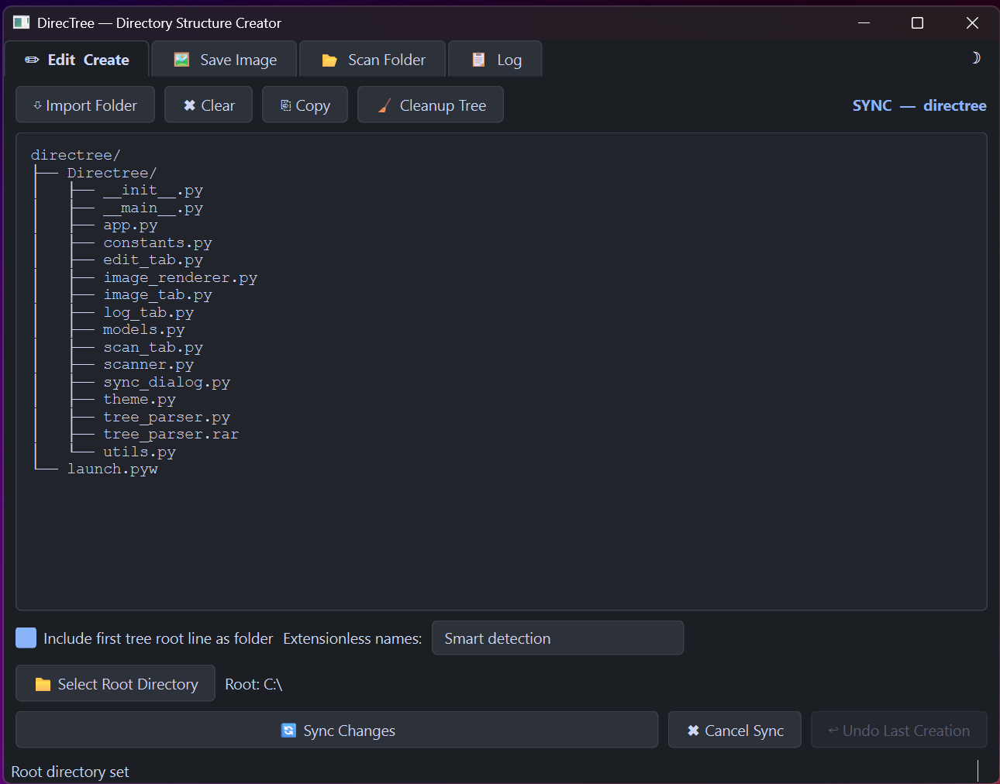
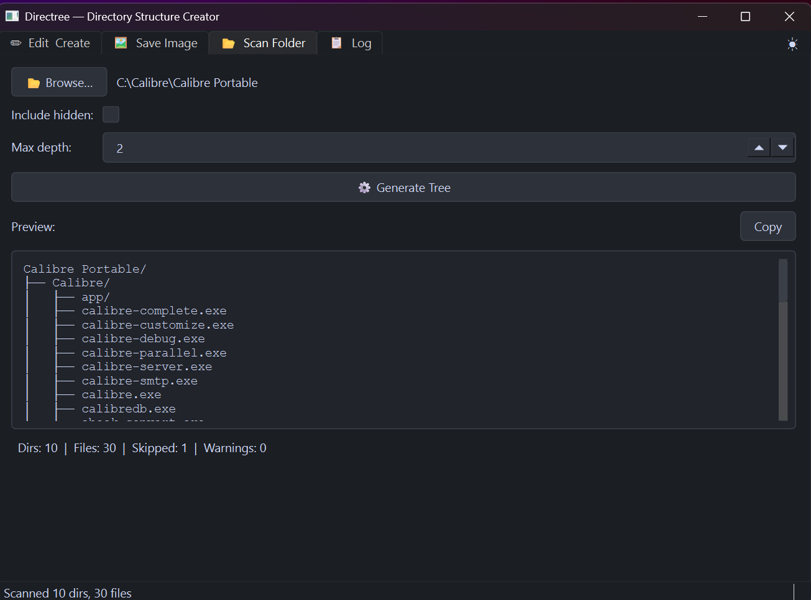
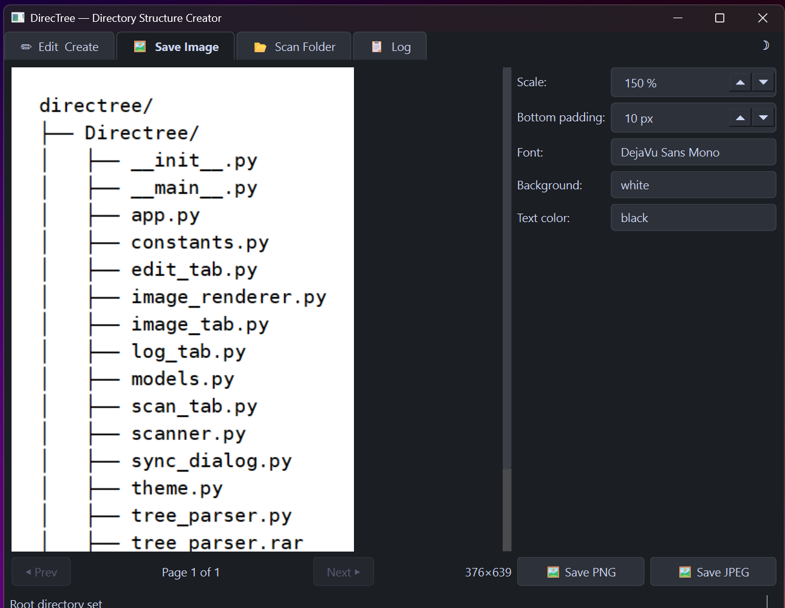
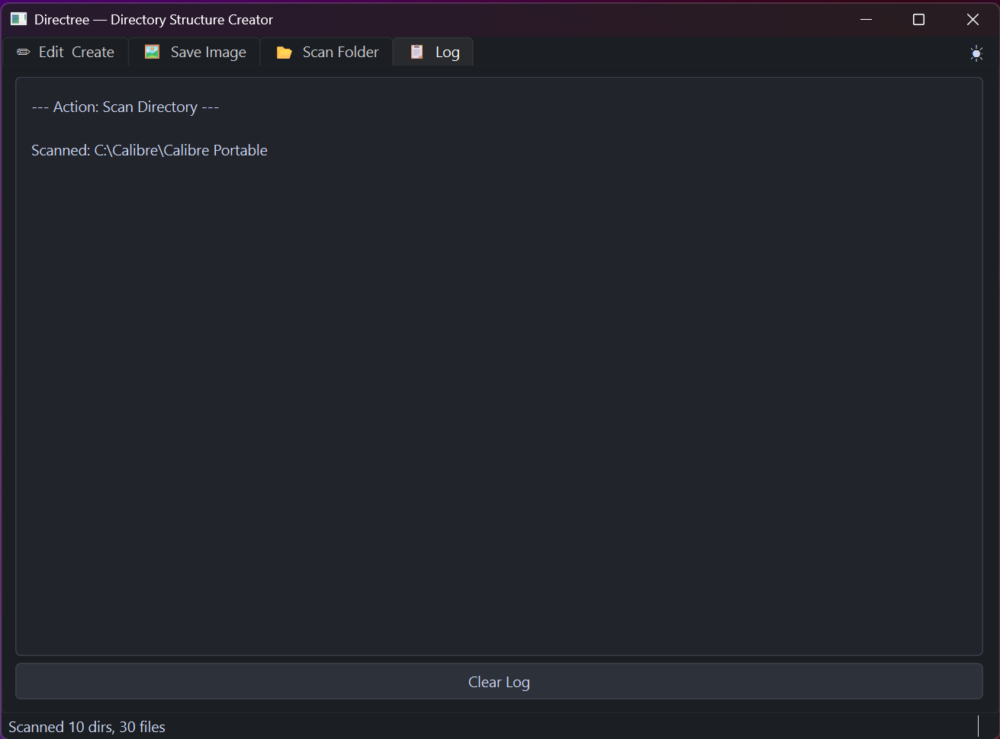

# DirecTree — Directory Structure Creator & Scanner

A two-way tool to **generate ASCII tree diagrams from real folders**, and **create, visualize, and sync directory structures from ASCII tree diagrams***

## Features

### 🡐 Edit & Create (Tab 1)



Paste or type an ASCII tree, pick a root directory, then **Create Structure** or
**Preview Plan**.  Inline `#` comments and `(...)` placeholders are
stripped automatically.  **Undo** removes only the items from the last action.

### 🡐 Sync Mode

After scanning a real folder, edit the tree and click **Sync Changes**.
Renamed items are **moved** (not deleted-and-recreated); added items are
created; removed items are deleted.

### 🡒 Scan Folder (Tab 3)



Browse any directory on your system, configure depth and hidden-file
filtering, and click **Generate Tree**.  The result auto-loads into the
editor and enters Sync Mode.  Common noise directories (`node_modules`,
`__pycache__`, `.git`, etc.) are skipped automatically.

### 🖼 Save Image (Tab 2)



Render any tree as PNG or JPEG with configurable **font**, **scale**,
**background colour**, and **text colour**.  Tall trees are split into
multiple page files (`_1`, `_2`, …) for compatibility with common viewers.
The preview updates live as you type in the editor.

### 📋 Log (Tab 4)



All create, sync, and undo actions are logged with timestamps and
per-item details.

### Modular Package

- **14 modules** in the `Directree/` package — clean separation of concerns
- Entry via `launch.pyw` or `python -m Directree`
- Zero circular imports; tabs access main window via Qt runtime

### UX

- **Dark/light theme** toggle (top-right corner of the tab bar)
- **Keyboard shortcuts** (`Ctrl+Enter` to create, `Ctrl+Shift+O` to scan, etc.)
- **Drag & drop** — drop a folder onto the editor to scan and import it
- **Tabbed interface**: Edit & Create, Save Image, Scan Folder, Log

## Requirements

- Python 3.8+
- PySide6 (`pip install PySide6`)

## Quick Start — Scan & Copy

```bash
python launch.pyw
```

1. Switch to the **Scan Folder** tab
2. Click **Browse…** and pick a directory
3. Click **Generate Tree**
4. Copy the resulting ASCII tree, or switch to **Save Image** to export as PNG/JPEG

## Quick Start — Paste & Create

1. Paste an ASCII tree into the **Edit & Create** tab:
   
   ```
   my-project/
   ├── src/
   │   └── main.py  # Entry point
   ├── (more files here)
   └── README.md
   ```

2. Click **Select Root Directory** and choose a target folder

3. Click **Create Structure**

## Quick Start — Sync

**Scan Folder** tab → **Generate Tree** → edit the tree in **Edit & Create** → click **Sync Changes**. Renamed items are moved (not deleted), new items are created, removed items are deleted.

## Files

| File/Dir     | Purpose                          |
| ------------ | -------------------------------- |
| `Directree/` | Application package (14 modules) |
| `monolith/`  | Single-file edition of the app   |
| `launch.pyw` | Entry-point launcher             |
| `Manual.md`  | Full user manual                 |
| `README.md`  | This file                        |
| `LICENSE`    | MIT License (add your own)       |
| `.gitignore` | Python gitignore                 |
